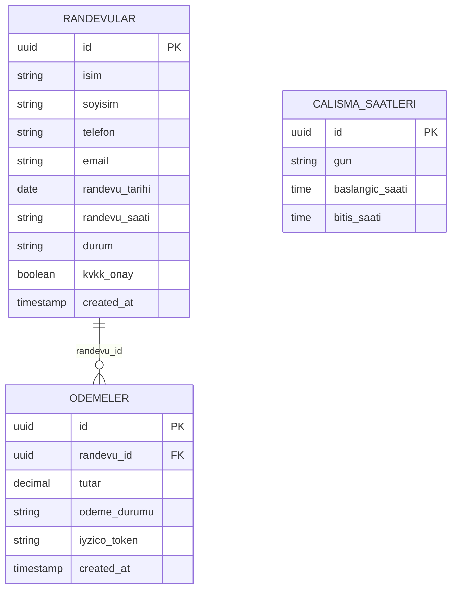

# 📅 KVKK Uyumlu Online Randevu & Güvenli Kapora Tahsilat Sistemi

<div align="center">


<p align="center">
  <strong>Doktorlar, Avukatlar, Diyetisyenler ve Bağımsız Danışmanlar İçin Randevu İptallerini (No-Show) Önleyen Modern Web Çözümü</strong>
</p>

[Canlı Demo](#-canlı-demo) • [Özellikler](#-öne-çıkan-özellikler) • [Test Kartları](#-test-kart-bilgileri-iyzico-sandbox) • [Kurulum](#-kurulum-ve-yerel-çalıştırma) • [Veritabanı Mimarisi](#-veritabanı-şeması)

</div>

---

## 💡 Projenin Amacı

Türkiye'de hizmet veren bağımsız profesyonellerin (hukuk büroları, klinikler, psikologlar, mali müşavirler) en büyük operasyonel kaybı **alınan randevulara gelinmemesi (no-show)** ve KVKK mevzuatına uyumsuz randevu toplama süreçleridir.

Bu proje:
1. **6698 Sayılı KVKK Kanunu'na tam uyumlu** aydınlatma metni ve açık rıza mekanizması sunar.
2. Randevu kesinleştirme aşamasında **50 TL güvence kaporası** tahsil ederek ciddiyetsiz randevuları engeller.
3. Sunucu maliyeti olmadan (**Serverless**), **Supabase PostgreSQL** ve **iyzico Sandbox** entegrasyonuyla 7/24 kesintisiz çalışır.

---

## ✨ Öne Çıkan Özellikler

- 🛡️ **6698 Sayılı KVKK Tam Uyumu:** 
  - Özel aydınlatma metni modalı ve zorunlu kullanıcı onay mekanizması.
  - Onaylanmayan formların gönderilmesini engelleyen görsel uyarı sistemi.
- 💳 **iyzico 3D Secure Kapora Tahsilatı:**
  - Gerçek zamanlı kart numarası formatlama (otomatik boşluk bırakma).
  - 3D Secure SMS doğrulama simülasyonu (`123456`).
  - Başarılı ödemelerde provizyon fişi ve işlem takip kodu üretimi.
- 🗄️ **Supabase PostgreSQL Backend:**
  - Güvenli `Row Level Security (RLS)` politikalarıyla korunan veri akışı.
  - `randevular` ve `odemeler` tabloları arasında dinamik ilişkilendirme.
- 📱 **Mobile-First & Modern Arayüz:**
  - Tailwind CSS ile hazırlanan, her ekran boyutuna (telefon, tablet, masaüstü) tam duyarlı tasarım.
  - Tıklanabilir dinamik saat dilimleri (09:30, 10:30, 11:30 vb.).
  - Geçmiş günlere randevu alınmasını engelleyen akıllı takvim kısıtı.

---

## 🌍 Canlı Demo

Web sitemiz Vercel altyapısı üzerinde SSL korumalı olarak yayındadır:

👉 **Canlı Site:** [https://online-randevu-sistemi.vercel.app](https://online-randevu-sistemi.vercel.app)

---

## 🧪 Test Kart Bilgileri (iyzico Sandbox)

Sistemi gerçek kredi kartı kullanmadan test edebilmeniz için tanımlanmış resmi test kartları:

| Durum | Kart Numarası | Son Kullanma | CVC | 3D SMS Kodu | Beklenen Sonuç |
| :--- | :--- | :--- | :--- | :--- | :--- |
| **Başarılı İşlem** | `5890 0400 0000 0016` | `12/30` | `123` | `123456` | ✅ Randevu onaylanır, `odemeler` tablosuna 50 TL kayıt düşer. |
| **Yetersiz Bakiye** | `5890 0400 0000 0024` | `12/30` | `123` | - | ❌ Ödeme reddedilir, kullanıcıya bakiye uyarısı verilir. |

> 💡 **İpucu:** Ödeme ekranındaki **"Kartı Doldur ⚡"** butonuna basarak başarılı test kartını tek tıkla otomatik doldurabilirsiniz.

---

## 🏛️ Veritabanı Şeması

Proje, Supabase (PostgreSQL) üzerinde ilişkisel 3 temel tablo barındırır:



---

## 🚀 Kurulum ve Yerel Çalıştırma

Projeyi kendi bilgisayarınızda yerel olarak çalıştırmak için:

### 1. Depoyu Klonlayın
```bash
git clone https://github.com/Metehanncakr-00/online-randevu-sistemi.git
cd online-randevu-sistemi
```

### 2. Supabase Veritabanını Hazırlayın
1. [supabase.com](https://supabase.com) üzerinde ücretsiz bir proje oluşturun.
2. Sol menüdeki **SQL Editor** bölümüne gidin.
3. Projede paylaşılan `schema.sql` dosyasının içeriğini yapıştırıp **Run** butonuna basarak tabloları ve RLS izinlerini oluşturun.

### 3. API Anahtarlarını Tanımlayın
`index.html` dosyasını bir metin düzenleyiciyle açın ve alt kısımda bulunan Supabase bilgilerinizi girin:

```javascript
const SUPABASE_URL = 'https://bjnxqjrotmmdhcetnqqq.supabase.co';
const SUPABASE_ANON_KEY = 'sb_publishable_Tt0IYc64ke9Jl7EjabME2Q_hBo0K35X';
```

### 4. Tarayıcıda Başlatın
Ek bir derleyiciye veya Node.js kurulumuna gerek yoktur. `index.html` dosyasına çift tıklayarak doğrudan tarayıcınız üzerinde sistemi deneyimleyebilirsiniz.

---

## 🛠️ Kullanılan Teknolojiler

- **Frontend:** HTML5, Modern Vanilla JS (ES6+)
- **Tasarım & UI:** Tailwind CSS CDN, Inter Typography, Heroicons
- **Veritabanı & Backend:** Supabase (PostgreSQL 15), Supabase JS Client v2
- **Ödeme Altyapısı:** iyzico Sandbox REST API Simülasyonu
- **Dağıtım (Deployment):** Vercel & GitHub Actions (CI/CD)

---

## 📄 Lisans

Bu proje [MIT Lisansı](LICENSE) kapsamında açık kaynak olarak paylaşılmıştır. Dilediğiniz gibi ticari veya kişisel projelerinizde kullanabilir ve geliştirebilirsiniz.

---

<div align="center">
  Geliştirici: <strong>Metehan Çakır</strong> 🚀
</div>
